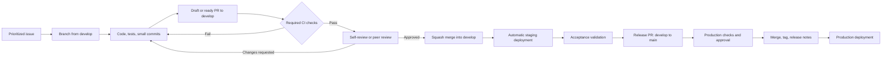
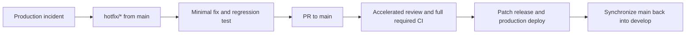

# MyRoutine — Development Governance and Delivery Design

**Status:** Approved design — implementation paused until the MVP is in production; see the implementation plan

**Date:** 2026-09-26

**Owner:** Luiz Marcelo

**Scope:** Repository governance, branching, pull requests, CI, environments, releases, and team scaling

## 1. Purpose

This document defines how MyRoutine will be developed and released as a commercial product. The process must work while the project has a single developer and become stricter without being redesigned when collaborators join.

The policy has four goals:

1. Keep production stable.
2. Make every change reviewable and auditable.
3. Detect quality and security problems before merge.
4. Give future team members a predictable way to contribute.

This is the approved target model. Repository files, GitHub Rulesets, deployment workflows, and project automation will be implemented in a separate execution plan.

## 2. Operating Model

MyRoutine will use a lightweight integration-branch workflow:

- `main` represents production and must remain releasable.
- `develop` represents the integrated candidate version and feeds staging.
- Short-lived work branches are created from `develop`.
- Every change reaches a protected branch through a Pull Request.
- Production releases move from `develop` to `main` through a dedicated release Pull Request.
- Critical production fixes use a controlled hotfix path from `main`.

This model is intentionally lighter than full GitFlow: it does not introduce permanent release branches or long-lived feature branches.

## 3. Daily Development Flow



The normal work cycle is:

1. Select an issue in `Ready` with a clear objective and acceptance criteria.
2. Create a short-lived branch from an updated `develop`.
3. Implement code, tests, and documentation using small, meaningful commits.
4. Open a Pull Request to `develop`; use Draft status while work is incomplete.
5. Fix every CI failure and resolve every review conversation.
6. Squash merge the approved Pull Request into `develop`.
7. Validate the integrated change in staging.
8. Include validated work in a release Pull Request from `develop` to `main`.
9. Merge the release, create a semantic version tag, publish release notes, and deploy production.

## 4. Branch Policy

### 4.1 Permanent branches

| Branch | Purpose | Deployment | Direct push |
|---|---|---|---|
| `main` | Production source of truth | Production | Forbidden |
| `develop` | Integrated candidate version | Staging | Forbidden |

### 4.2 Short-lived branches

| Prefix | Use | Base | Normal target |
|---|---|---|---|
| `feature/` | New product capability | `develop` | `develop` |
| `fix/` | Non-emergency defect correction | `develop` | `develop` |
| `chore/` | Dependencies, tooling, or maintenance | `develop` | `develop` |
| `docs/` | Documentation-only work | `develop` | `develop` |
| `refactor/` | Internal change without intended behavior change | `develop` | `develop` |
| `hotfix/` | Urgent production correction | `main` | `main`, then `develop` |

Branch names use English, lowercase letters, hyphens, and the issue number:

```text
feature/42-task-rollover
fix/57-invalid-card-total
hotfix/63-login-failure
chore/71-update-actions
docs/75-development-policy
```

Branches are deleted automatically after merge. Force pushes and branch deletion are forbidden on `main` and `develop`.

## 5. Issues and Work Tracking

The board lifecycle is:

```text
Backlog → Ready → In Progress → In Review → Staging → Done
```

### 5.1 Definition of Ready

An issue can enter `Ready` only when it has:

- A user or business objective.
- A bounded scope.
- Verifiable acceptance criteria.
- Known dependencies and risks relevant to starting the work.
- Enough context for another developer to understand the expected outcome.

Templates will exist for features, bugs, and technical improvements.

### 5.2 Definition of Done

Work is `Done` only when:

- The implementation is reviewed and merged.
- All required CI checks pass.
- Acceptance criteria are validated.
- Relevant automated tests are present.
- Documentation is updated.
- Staging validation is complete when applicable.
- No known critical or high vulnerability remains in the delivered change.
- Production observability and operational impact have been considered.

## 6. Pull Request Policy

Every Pull Request must describe:

- Context and problem.
- Implemented solution.
- Linked issue.
- Acceptance criteria covered.
- Test evidence.
- UI evidence when visual behavior changes.
- Security, migration, compatibility, and rollback risks.
- Documentation changes.

The author performs a self-review before requesting review. Review conversations must be resolved before merge, and the source branch must be current with its target.

Large Pull Requests should be divided into independently reviewable changes whenever possible. Size is a reviewability signal rather than a rigid line-count gate.

## 7. Review Policy by Team Stage

### 7.1 Solo stage

- Pull Requests remain mandatory.
- Required CI checks remain mandatory.
- The author completes the PR checklist and self-review.
- Luiz may merge his own approved and green Pull Request.

### 7.2 Collaborative stage

As soon as another regular contributor joins:

- At least one independent approval is required for `develop` and `main`.
- The most recent approving review is dismissed when protected code changes materially.
- Code-owner approval is required for owned areas.
- The author cannot satisfy the independent approval requirement.

Sensitive infrastructure and security changes may require an additional qualified reviewer as the team grows.

## 8. Commit and Merge Strategy

Commits follow Conventional Commits:

```text
feat(planner): add task rollover
fix(finance): correct installment totals
test(habits): cover streak calculation
docs(project): document delivery workflow
refactor(auth): isolate token validation
chore(deps): update frontend dependencies
ci(github): validate pull requests to develop
```

Merge rules:

- Work branches into `develop`: **squash merge**.
- Release Pull Requests from `develop` into `main`: **merge commit** to preserve ancestry.
- Hotfix Pull Requests into `main`: reviewed merge followed by synchronization back into `develop`.
- Protected branches never accept unreviewed direct commits.

## 9. Continuous Integration Gates

CI runs on Pull Requests targeting both `develop` and `main`. A merge is blocked until all applicable required checks pass.

### 9.1 Repository security

- Gitleaks secret scanning.
- Dependency integrity verification.
- No secrets committed to the repository or stored in tracked environment files.

### 9.2 Go backend

- Dependency download and verification.
- `gofmt` validation.
- Build.
- `go vet`.
- Tests with the race detector and coverage output.
- Semgrep SAST.
- `govulncheck`.
- Staticcheck.

### 9.3 React frontend

- Reproducible installation with `npm ci`.
- TypeScript type checking.
- Lint.
- Automated tests.
- Production build.
- Dependency audit at high severity or above.

### 9.4 Expo mobile application

- Reproducible installation.
- TypeScript type checking.
- Automated tests.

### 9.5 Containers

- Reproducible Docker image builds.
- Trivy scan for high and critical vulnerabilities.
- Security results published to the GitHub security interface when supported.

CI and deployment are separate workflows. Passing CI proves that a revision is eligible to merge; it does not independently authorize a production deployment.

## 10. Environments and Deployment

| Environment | Source | Purpose | Trigger |
|---|---|---|---|
| Local | Work branch | Development and focused testing | Developer action |
| Staging | `develop` | Integration and acceptance testing | Merge into `develop` |
| Production | `main` release | Customer-facing system | Approved release |

Work branches do not require permanent environments. Preview environments may be added later when their operational value justifies the cost.

Deployment workflows must use environment-scoped secrets. Production will use GitHub Environment protection and may add a manual approval gate as the team grows.

## 11. Releases and Versioning

MyRoutine uses Semantic Versioning:

- `MAJOR`: incompatible product or platform change.
- `MINOR`: backward-compatible feature release.
- `PATCH`: backward-compatible defect or security correction.

Examples: `v0.1.0`, `v0.2.0`, `v0.2.1`, and `v1.0.0`.

A production release includes:

- A reviewed Pull Request from `develop` to `main`.
- Green production-required checks.
- A version tag.
- Release notes describing user-visible changes, fixes, risks, and migrations.
- A defined rollback path for changes that affect runtime or data.

## 12. Hotfix Flow



Urgency shortens waiting time, not quality controls. Every hotfix requires an issue, a regression test when technically possible, a Pull Request, required CI, release notes, and synchronization back to `develop`.

## 13. Roles and Responsibilities

One person may hold multiple roles during the solo stage, but responsibilities remain explicit:

- **Product Owner:** prioritizes value, defines acceptance criteria, and accepts outcomes.
- **Tech Lead:** protects architecture, engineering standards, and technical direction.
- **Developer:** implements, tests, documents, and prepares the Pull Request.
- **Reviewer:** evaluates correctness, maintainability, security, and product impact.
- **QA:** validates acceptance criteria and regression risk in staging.

## 14. Repository Governance

GitHub Rulesets will protect `main` and `develop` with:

- Pull Requests required before merge.
- Required CI status checks.
- Resolved review conversations.
- Source branch freshness.
- Direct push, force push, and deletion restrictions.
- Progressive approval requirements described in Section 7.

`CODEOWNERS` initially assigns the whole repository to Luiz. Ownership can later be divided among backend, frontend, mobile, infrastructure, security, and documentation. `CODEOWNERS` identifies reviewers; enforcement comes from the branch Ruleset.

Dependency updates are submitted through automated Pull Requests and pass through the same checks as human changes.

## 15. Scaling Stages

### Stage A — Solo development

- Mandatory Pull Requests, self-review, and CI.
- Luiz owns product, technical direction, implementation, and release decisions.
- Staging and production remain separated.

### Stage B — Closed beta team

- Independent approval required.
- QA responsibility assigned for each release.
- Release notes and rollback checks become mandatory evidence.
- Ownership starts to be divided by technical area.

### Stage C — Commercial scale

- Multiple code owners and least-privilege repository roles.
- Stronger production environment approvals.
- Service-level objectives, incident process, and on-call ownership.
- Automated dependency maintenance, audit retention, and release metrics.
- Governance changes made through reviewed Pull Requests to this policy.

## 16. Decision Summary

The approved choices are:

1. `main` is production; `develop` is staging integration.
2. Work happens in short-lived, issue-linked branches.
3. Every change uses a Pull Request and mandatory CI.
4. Solo work permits self-merge after self-review and green checks.
5. The first regular collaborator activates independent approval.
6. Work PRs use squash merge; release PRs use merge commits.
7. CI and deployment remain separate concerns.
8. Releases use Semantic Versioning, tags, and release notes.
9. Hotfixes preserve review, testing, auditability, and back-synchronization.
10. Rules become stricter by team stage without changing the core workflow.

## 17. Implementation Boundary

The implementation plan following this design will cover:

- Creation of `develop`.
- CI trigger and required-check adjustments.
- Contribution guide and development policy.
- Pull Request and issue templates.
- `CODEOWNERS`.
- Branch/commit conventions and local developer commands.
- GitHub Rulesets for `main` and `develop`.
- Release and changelog automation.
- Staging and production deployment workflow foundations.

Product feature development, hosting-provider selection, AI integration, and application-store distribution remain separate initiatives with their own designs and plans.
